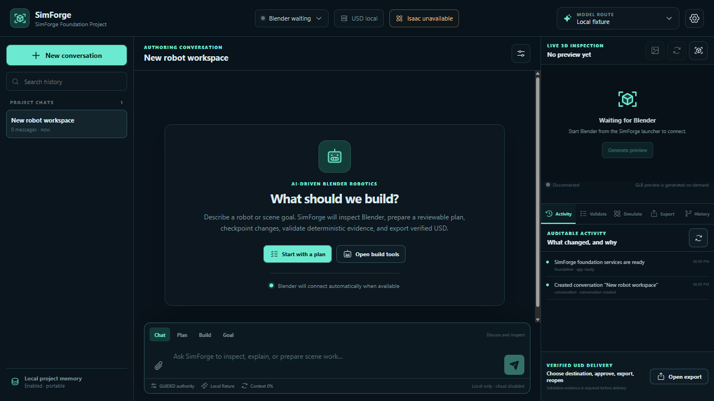

# SimForge

SimForge is a Windows-first, local-first desktop application for conversational robotics
authoring in a real Blender scene. It turns a goal into a visible, approval-controlled
loop: inspect → plan → build → validate → correct → export → reopen → simulate.



Blender remains the visual source of truth. Deterministic geometry, robotics, OpenUSD,
and Isaac Sim checks provide evidence; model commentary is advisory. Guided, Balanced,
and Autonomous authority let users choose speed without removing permanent approval gates.

## Download

Download **v0.1.2** from [GitHub Releases](https://github.com/aminezombor/SimForge/releases/tag/v0.1.2):

- `SimForge-Setup.exe` — Windows installer (unsigned)
- `SimForge-win32-x64-0.1.2.zip` — portable SmartScreen fallback
- `simforge_bridge-0.1.0.zip` — Blender extension
- `SimForge-Warehouse-Sample-0.1.2.zip` — sanitized sample project and verified USD
- `SHA256SUMS.txt` — integrity hashes

Supported baseline: Windows 11 x64 and Blender 4.5 LTS. NVIDIA NIM/Nemotron is the
primary demo provider; the key is optional for deterministic local workflows. Isaac Sim
6.0.1 is optional, separately installed, and not required for authoring or USD export.

## Five-Minute Judge Test

1. Install SimForge, or extract the portable ZIP and run `SimForge.exe`.
2. Install Blender 4.5 LTS and the release extension ZIP in Blender Preferences → Get
   Extensions → Install from Disk. Launch Blender once.
3. Open SimForge Settings → Environment and run **Recheck**. Blender, extension,
   storage, loopback, and bundled OpenUSD should pass; unconfigured providers/Isaac warn.
4. Optional: in Settings → AI providers, save an NVIDIA key, then select **Discover
   models**. The key stays in Windows-protected storage and must never be pasted into chat.
5. In a new chat, enter `prepare for me in blender a wheeled robot with a gripper hand`.
   Review **Approve plan & build**, then confirm the exact checkpointed Blender action.
6. After Blender visibly creates the robot and workcell, enter
   `export this robot to USD for simulation`, choose an empty destination, and approve.
   Confirm 12 reopen checks and physics/composition layers.
7. If Isaac Sim is configured, enter `send it to simulation in Isaac Sim`. Approve the
   run, review the retained stability failure, approve the checkpointed Blender correction,
   re-export, and rerun. The corrected waypoint task should pass and open natively.

Exact clicks, expected text, timings, fallback evidence, and troubleshooting are in
[the owner/judge procedure](docs/OWNER_JUDGE_TEST.md).

## What Works

- Persistent conversations, goals, checkpoints, revisions, branches, activity, and recovery
- Runtime NVIDIA/OpenAI model discovery and capability-aware routing
- Authenticated loopback Blender 4.5 bridge with fresh snapshots and stale-edit rejection
- Generated warehouse manipulator plus licensed URDF and native-format staging paths
- Deterministic geometry/robotics checks and reversible or exact-approved fixes
- Revision-stamped 3D previews, visual review, modular USD export, and deep reopen
- Optional Isaac failure → approved Blender correction → passing parent-linked rerun
- Sandboxed Electron renderer, narrow IPC, DPAPI credentials, path containment, and no telemetry

## Development

Prerequisites: Windows 11 x64, Node.js 24+, pnpm 10+, and Blender 4.5 LTS for live tests.

```powershell
pnpm install
pnpm verify
pnpm make
pnpm package:extension
```

`pnpm verify` runs TypeScript, ESLint, Vitest, and the secret scan. Live Blender and Isaac
tests are opt-in; see [acceptance tests](docs/ACCEPTANCE_TESTS.md). Project data remains
portable, while global settings and protected credentials live under
`%LOCALAPPDATA%\SimForge`.

## Security, Licensing, and Limitations

The renderer has no Node or filesystem authority. Cloud dispatches identify provider,
model, purpose, and data classes first. Never put secrets in prompts, screenshots, source,
logs, or issue reports. See [Security](docs/SECURITY.md) and [Privacy](docs/PRIVACY.md).

The desktop source is Apache-2.0; Blender-loaded extension source is GPL-3.0-or-later.
See [third-party notices](THIRD_PARTY_NOTICES.md) and the
[dependency inventory](docs/DEPENDENCIES_AND_LICENSES.md).

Known limitations: the installer is unsigned; Blender and Isaac are not bundled; this
release targets Windows 11 x64; Isaac evidence was produced below NVIDIA's published
minimum hardware and uses a bounded sample; visual-model review is optional; broader CAD,
Linux, and full format guarantees remain post-hackathon work.

Uninstall SimForge from Windows Installed apps. Remove the Blender extension in Blender
Preferences. Delete `%LOCALAPPDATA%\SimForge` only if you also want to remove protected
settings and local app state; portable project folders are separate and are not removed.

## Architecture and Codex

Electron/TypeScript owns policy, storage, providers, jobs, and files; a thin GPL Blender
extension performs structured `bpy` work; a bundled Python/OpenUSD sidecar authors and
reopens neutral USD; optional Isaac runs fixed local experiments. See
[Architecture](docs/ARCHITECTURE.md) and [decisions](docs/DECISIONS.md).

Codex with GPT-5.6 translated the master brief and owner refinements into 133 traceable requirements, evaluated
architecture and dependencies, implemented the vertical slices, drove real Blender/USD/
Isaac acceptance, debugged packaging and security issues, and maintained evidence and
release documentation. The detailed record is in [the Codex usage log](docs/CODEX_USAGE_LOG.md).
