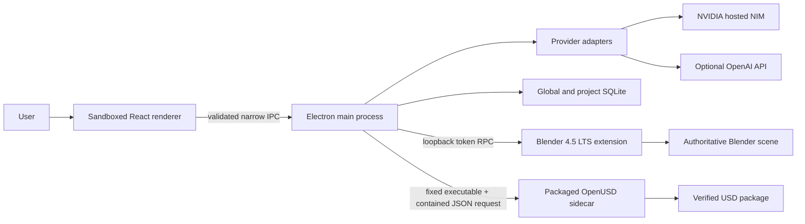

# Architecture

## Status and Quality Attributes

- Status: Approved baseline (DEC-004 through DEC-011)
- Implementation: MS1/MS2 foundation implemented, packaged, and verified
- Target: Windows 11 x64, separately installed Blender 4.5 LTS
- Priorities: scene truth, safety, recovery, testability, judge reproducibility, delivery speed, future Linux/Isaac extension

## System Context



There is no local HTTP server and no remote web UI. The main process is the trust boundary and sole owner of provider calls, secrets, filesystem writes, jobs, policy, bridge sessions, and sidecars.

## Desktop Boundaries

### Renderer

React and `@assistant-ui/react` 0.14.27 render local-runtime chat, projects,
approvals, activity, provider disclosure, jobs, and honest validation state. No
Assistant Cloud or provider-coupled renderer transport is used. The renderer has no
Node integration, secret access, raw filesystem access, arbitrary process launch,
provider credentials after configuration, or direct Blender connection. Packaged
smoke evidence confirms context isolation, Chromium sandboxing, restrictive CSP,
validated sender origins, permission denial, safe navigation, and the narrow preload API.

### Main process

Domain services are separated by interface:

- `ProjectRepository` and `GlobalRepository`
- `ConversationService` and scoped `MemoryService`
- `ProviderRegistry` and `CapabilityRouter`
- `ToolRegistry`, `PolicyEngine`, and `ApprovalService`
- `JobOrchestrator` and `CheckpointService`
- `BlenderBridge` and `SceneStateService`
- `ValidationEngine` and `FixService`
- `ImportService`, `ExportService`, and `UsdWorkerClient`
- `AuditLog` with structural redaction

Renderer IPC namespaces are limited to `project`, `conversation`, `provider`, `job`, `approval`, `scene`, `validation`, and `export`. Each call validates a versioned request/response schema and the current window/project/session authority.

## Persistent Data Model

### Global application data

Stored under `%LOCALAPPDATA%\SimForge`:

- `global.sqlite`: project index, non-secret provider profiles, application preferences, optional global memory, schema migrations
- encrypted secret blob: DPAPI-backed Electron `safeStorage`; never copied into a project
- `runtime/`: short-lived Blender session descriptors with user-only ACLs
- redacted rotating logs and crash diagnostics, disabled or minimized by user controls

### Portable project

```text
project-root/
  simforge.project.json
  .simforge/
    project.sqlite
  scene/
    project.blend
  references/
  scripts/generated/
  checkpoints/<checkpoint-id>/
  previews/<scene-revision>/
  exports/<export-version>/
  reports/
```

The manifest contains format version, stable project ID, display name, creation/update times, relative Blender path, and migration version. Databases store projects, conversations, messages and multimodal parts, branches, scoped memories, plans/tasks, approvals, jobs/attempts, actions/tool calls, scene revisions/diffs, checkpoints, validation runs/findings/fixes, assets/licenses, exports/manifests, and usage records. Actions and approvals are append-only; user deletion uses explicit scoped operations.

Only the main process writes SQLite. One mutating job per project is allowed during the hackathon; read-only inspection and chat continue. Checkpoints combine a Blender save-copy, SQLite backup, project-file hash inventory, task position, and manifest.

## Versioned Contracts

JSON Schema is canonical for IPC, Blender RPC, provider events, importer output, validation, and manifests. Generated TypeScript types and Python validation consume the same schemas.

### Provider adapter

```text
discoverModels(profile) -> ModelDescriptor[]
probeCapabilities(model) -> CapabilityRecord
stream(ProviderRequest, AbortSignal) -> AsyncIterable<ProviderEvent>
cancel(requestId)
```

Capabilities include text, vision, tool calling, streaming, structured output,
reasoning controls, context/output limits, and usage reporting. Implemented adapters
provide discovery, real non-mutating probing, normalized streaming/tool/usage events,
AbortController-backed cancellation, and clear errors. Provider requests use normalized
messages/parts, tools, attachments, and purpose.

NVIDIA hosted NIM is primary. Nemotron 3 Ultra is selected only after discovery/probe
and is treated as text-only. OpenAI Responses is optional. Capability records are
cached in global SQLite and can be re-probed. Before cloud dispatch, the renderer shows
provider, model, purpose, and included text/image/file classes. Deterministic adapter
tests pass. The packaged live probe discovered 119 NVIDIA models, found the intended
Nemotron identifier, streamed text, and observed a valid no-op tool call without
executing it; the endpoint also accepted an explicit `enable_thinking: false` probe.
Vision remains false and unsupported/unprobed capabilities remain explicitly `unknown`;
see `docs/evidence/NVIDIA_PROVIDER_ACCEPTANCE.json`.

### Tool and approval model

Each tool declares ID/version, input/output schema, read/write class, supported modes, risk class, reversibility, checkpoint rule, approval rule, path scope, timeout, and idempotency behavior.

- Normal Chat: conversational and explicitly requested low-risk operations.
- Plan Mode: read-only tools are the only tools supplied and accepted.
- Build Mode: structured mutations within an approved plan and current revision.
- Goal Mode: persistent orchestration; it never expands tool authority.

Approvals bind the actor, project, plan hash, task/action scope, risk summary, scene revision, expiry, and decision. A changed plan, expired approval, different project, or stale scene invalidates it.

## Blender Integration

The app opens a random `127.0.0.1` TCP listener and writes a short-lived descriptor containing protocol version, port, app PID, expiry, and 256-bit token to a user-only runtime file. The installed GPL Blender extension reads an explicitly selected descriptor and connects outbound. It never listens on the LAN.

Messages use a length-prefixed UTF-8 JSON envelope:

```text
request:  protocolVersion, requestId, projectId, expectedSceneRevision,
          operation, payload, deadline
response: requestId, ok/error, preRevision, postRevision,
          changedEntityIds, warnings, result
event:    eventId, projectId, sceneRevision, kind, changedEntityIds, summary
```

The token is used during the authenticated handshake, not repeated in logs. Size limits, timeouts, rate limits, schema validation, and per-session project binding apply.

A socket thread only parses and queues. `bpy.app.timers` executes scene access on
Blender's main thread. Dependency-graph handlers track relevant manual changes.
Structured-created entities receive stable `simforge.id` properties; read-only
inspection uses session IDs without mutating manual objects. A process-local revision
counter is seeded from the app-persisted monotonic revision floor on reconnect. A
mutating request with a mismatched expected revision returns `STALE_SCENE`, causing
refresh and replanning rather than overwrite.

The MS1-MS4 operation set covers evidence-rich snapshot, complete checkpoint
copy/restore, primitive creation, exact object location, approved scale application,
object deletion, controlled Python fallback, exact-approved robot materialization and
link-pose correction, and revision-stamped materialized review rendering. Later
milestones add the remaining typed collection/import/export operations. Python
fallback is disabled in Plan Mode and requires displayed intent, exact approval,
pre-checkpoint, raw-script hash, declared contained paths, reusable project archive,
audit entry, and post-execution snapshot. It is privileged, not sandboxed.

## Import Architecture

All imports enter a staging collection/project copy and produce an `ImportReport`. Blender native importers handle `.blend`, USD, GLB/GLTF, FBX, OBJ, and STL. Robot-description sidecars normalize URDF/MJCF into:

```text
RobotGraph {
  source, units, coordinateConvention, links[], joints[], visuals[],
  collisions[], inertials[], materials[], sensors[], assetReferences[], warnings[]
}
```

Resolved files must remain inside an approved import root. Remote URLs, executable plugins, automatic Xacro expansion, and path escape are rejected. `package://` mappings require an explicit user-selected root. Every import records conversions, losses, assumptions, missing assets, license/source, and validation status.

## Validation and Correction

The orchestrator runs five evidence channels: fresh Blender snapshot, deterministic geometry/metadata rules, deterministic robotics rules, OpenUSD inspection, and materialized multi-angle renders. Visual-model output is advisory.

```text
Finding {
  ruleId, runId, domain, severity, entityPath, message,
  deterministicEvidence, assumptions, proposedFixId,
  fixClass, status
}
```

Rule classes cover geometry, topology, scene organization, materials/references, robot graph, collision, mass/inertia, joints/articulation, sensors, and USD composition. Physical values are never fabricated without an explicit recorded assumption.

Fix classes are `SAFE_LOCAL`, `STRUCTURAL`, `CREATIVE`, `DESTRUCTIVE`, and `UNKNOWN`. Only `SAFE_LOCAL` may auto-run, and only when preconditions match the current revision, the operation has an inverse or checkpoint, and post-validation passes. All other classes require approval.

MS3 materializes the first channel as 18 stable `GEO-*` rules over fresh Blender
snapshots. Snapshots include units, Z-up convention, visibility, world bounds, mesh
counts and topology evidence, materials, and local external-file existence. Findings,
runs, and correction records persist in dedicated SQLite tables. Conservative AABB
overlap remains an informational review signal, and Z=0 ground contact is an explicit
project assumption.

MS4 adds a versioned `RobotGraph` with stable IDs for links, joints, collisions,
materials, sensors, conventions, and source-tagged physical values. Blender materializes
the actual hierarchy plus renderable sensor representations through exact-approved
structured operations. Stable `ROB-*` findings compare graph intent with fresh world
poses, parenting, joint topology/axes/limits/drives, collision/contact policy,
dynamic/static flags, physics material IDs, mass, center of mass, inertia, and sensor
frames/FOV. Unknown or assumed values remain labeled rather than fabricated.

The review service produces lit materialized three-quarter/front/side/close-up/sensor
PNGs in a revision-unique project path, hashes them into a validated manifest, and only
serves stored integrity-checked images to the renderer. Temporary lights, camera, and
ground are removed without advancing the Blender revision. Visual evidence remains
advisory. MS5 adds the independent OpenUSD channel; channel separation prevents partial
evidence from claiming complete readiness.

## USD Export Package

Blender exports selected visual geometry plus a source `.blend` into project-contained
staging. The packaged Python 3.13.14/`usd-core` 26.5 sidecar authors composition,
UsdPhysics, sensor metadata, reports, and manifest data through `pxr`. It receives a
contained JSON request-file path through a fixed argument array and never a shell command.

```text
<slug>/
  scene.usda
  robot/
    robot.usda
    geometry/robot_geometry.usdc
    materials/robot_materials.usda
    physics/robot_physics.usda
    sensors/robot_sensors.usda
  environment/environment.usda
  source/
    project.blend
    simforge.project.json
    actions.json
    scripts/
  validation/
    validation-results.json
    readiness-report.md
    preview-images/
  manifest.json
  THIRD_PARTY_NOTICES.md
```

The package uses Z-up, meters-per-unit `1.0`, a declared default prim, relative references, normalized names, and hashes for packaged files. Quick export flattens a verified stage to one `.usdc`. Canonical export first writes a temporary sibling directory, validates/reopens all entry stages and references, then atomically promotes it after explicit destination/overwrite/package approval.

P0 checks stage open, default prim, units/up axis, relative reference resolution, containment, layers, materials, UsdPhysics schemas, link/joint relationships, mass/inertia metadata, sensors, manifest hashes, and portability. Isaac-specific schemas are not required; V2 adds optional layers and simulation adapters.

## Failure and Recovery Model

- Provider: cancel stream, retain partial activity, classify retryable failure, offer configured fallback without duplicating tool effects.
- Blender: mark disconnected, stop new mutations, preserve job/checkpoint, reconnect and refresh before resume.
- Stale scene: reject mutation, show diff, refresh plan/approval as necessary.
- Long operation: visible phase/progress when deterministic, cancellation request, timeout, and recovery instructions.
- Database: transaction boundaries, migrations with backup, periodic checkpoint backup, corruption diagnostic.
- Export: build in temporary destination, never overwrite without approval, retain failed validation artifacts separately.

## Deployment

Electron Forge produces a Windows installer and portable ZIP. Blender remains a separate prerequisite. The release bundles the fixed OpenUSD sidecar and Blender extension installer files, but no API key, Blender binary, or Isaac Sim. Auto-update is outside P0. Unsigned-build limitations must be documented if no certificate is available.

MS1 proves the portable Electron package and extension ZIP; MS5 embeds the fixed
Python/OpenUSD runtime and proves it from packaged resources. MS9 still owns installer,
portable release, clean-account, signing, upgrade/uninstall, and distribution audits.
